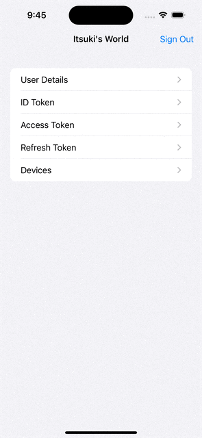

# Authentication with Cognito User Pool

This demo uses the AWS SDKs to implement the entire authentication flow natively focusing on Sign-in with persistent passwords, ie: the traditional username and password sign in.

The following capabilities are included.
- Sign up + Confirm sign up with confirmation code
- Sign in
- Sign out
- Forgot password + change password with confirmation code
- Change password
- Retrieve Tokens (ID Token, Access Token, and Refresh Token)
- Retrieve User Info (Details, attributes, devices)

For more details, please refer to my blog: [SwiftUI: Authentication with Amazon Cognito User Pool]()
